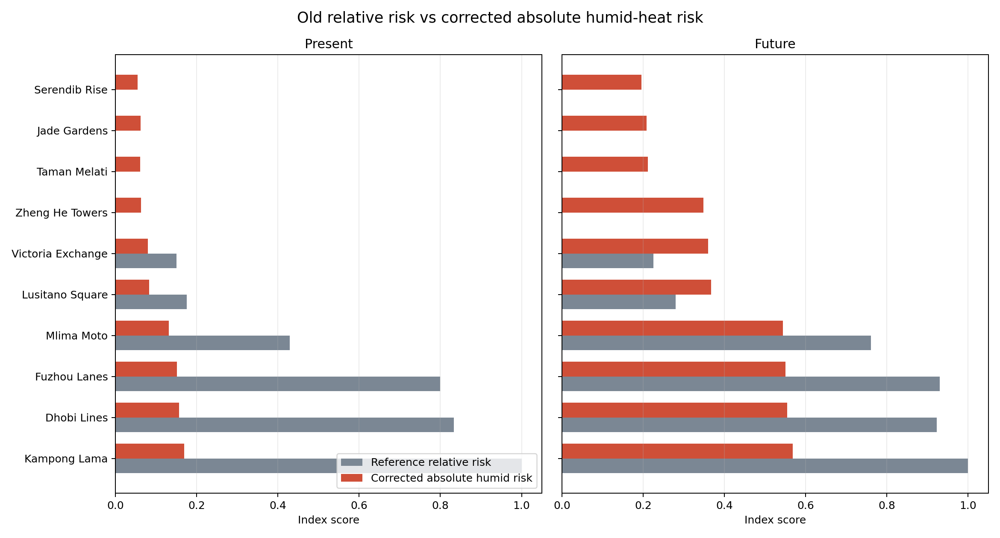
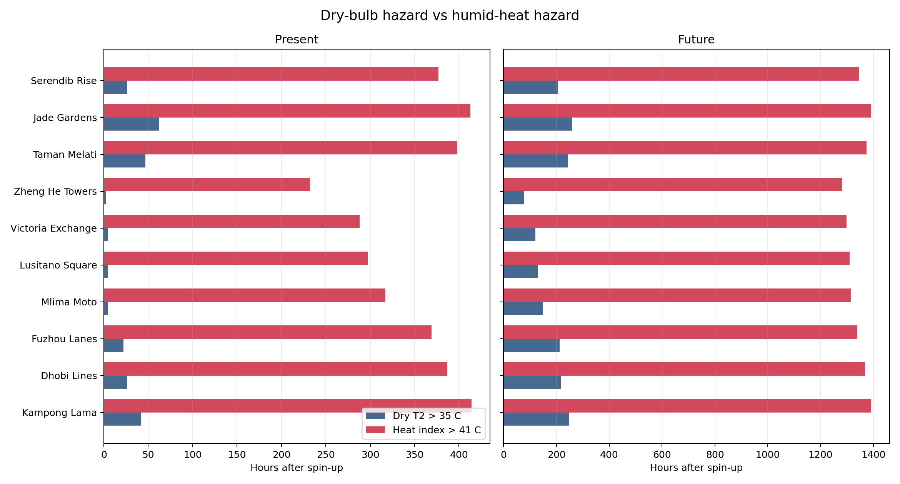
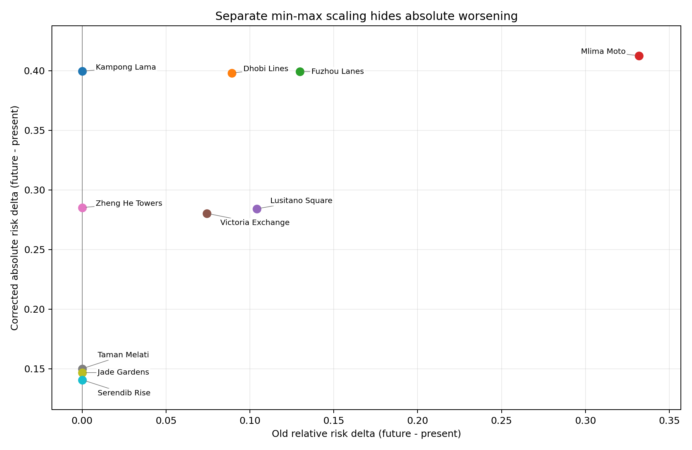
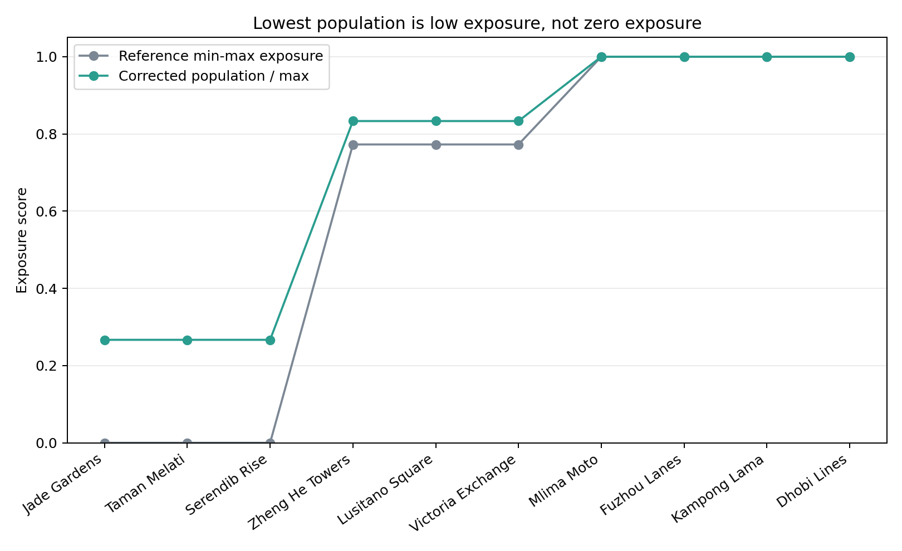

<link rel="stylesheet" href="assets/pages.css">

# SUEWS Hackathon UDA-city Practice

This repository uses the released UDA-city dataset and compares the supplied
reference risk bridge against a corrected index that addresses four specific
alignment problems.

Dataset: [UMEP-dev/uda-city-hackathon](https://github.com/UMEP-dev/uda-city-hackathon)

<section class="reviewer-summary" aria-labelledby="reviewer-answer-title">
  <div>
    <p class="summary-kicker">Reviewer answer</p>
    <h2 id="reviewer-answer-title">Yes: the corrected UDA-city index is a more faithful first-pass humid-heat comparison for the four tested alignment problems.</h2>
    <p>The corrected index keeps low exposure nonzero, uses one absolute scale for present and future, brings humidity into the hazard through heat-index hours, and reports social sensitivity without letting one low pillar erase total risk.</p>
  </div>
  <aside class="summary-verdict" aria-label="Review boundary">
    <span>Boundary</span>
    <strong>Corrected comparison, not a final city risk model.</strong>
    <p>The results table and four plots support the tested fixes; the ideas list marks the next design pass.</p>
  </aside>
</section>

<section class="metric-strip" aria-label="Core metrics">
  <article>
    <span>Recovered low exposure</span>
    <strong>0 -> 0.062 / 0.209</strong>
    <p><code>Jade Gardens</code> changes from reference zero to corrected present / future risk.</p>
  </article>
  <article>
    <span>Humid-heat signal</span>
    <strong>414 vs 42 hours</strong>
    <p><code>Kampong Lama</code> present hazard is much larger with heat-index hours than dry-bulb hours.</p>
  </article>
  <article>
    <span>Absolute worsening</span>
    <strong>0.169 -> 0.569</strong>
    <p><code>Kampong Lama</code> remains top risk while future corrected risk rises on the same scale.</p>
  </article>
</section>

<nav class="evidence-path" aria-label="Evidence path">
  <span>Evidence path</span>
  <a href="#four-tested-fixes">Fixes</a>
  <a href="#corrected-index">Formula</a>
  <a href="#new-result">Results</a>
  <a href="#comparison-plots">Figures 1-4</a>
  <a href="#ideas-not-fixed-yet">Boundary</a>
</nav>

## Four tested fixes

The supplied bridge is useful as a teaching baseline, but this page audits four
specific alignment problems. Each card maps one problem to its correction,
figure, and local key number. The boundary is unchanged: this is an index audit,
not a final operational city-risk model.

<section class="fix-ladder" aria-label="Four tested fixes">
  <article class="fix-card">
    <span>Fix 1</span>
    <h3>Zero-kill social sensitivity</h3>
    <dl>
      <div>
        <dt>Problem</dt>
        <dd>The geometric mean turns any zero social pillar into total risk <code>0</code>.</dd>
      </div>
      <div>
        <dt>Correction</dt>
        <dd><code>social sensitivity = mean(exposure, vulnerability)</code> avoids zero-killing the index.</dd>
      </div>
      <div>
        <dt>Figure</dt>
        <dd><a href="#figure-1">Figure 1</a></dd>
      </div>
      <div>
        <dt>Key number</dt>
        <dd><code>Jade Gardens</code>: reference risk index <code>0</code> -> corrected risk index <code>0.062</code> present / <code>0.209</code> future.</dd>
      </div>
    </dl>
  </article>
  <article class="fix-card">
    <span>Fix 2</span>
    <h3>Humid heat enters the hazard</h3>
    <dl>
      <div>
        <dt>Problem</dt>
        <dd>Dry-bulb <code>T2 &gt; 35 C</code> misses the hot-humid burden.</dd>
      </div>
      <div>
        <dt>Correction</dt>
        <dd>Humid hazard uses <code>hours(heat index &gt; 41 C) / analysis hours</code>.</dd>
      </div>
      <div>
        <dt>Figure</dt>
        <dd><a href="#figure-2">Figure 2</a></dd>
      </div>
      <div>
        <dt>Key number</dt>
        <dd><code>Kampong Lama</code> present hazard: <code>42</code> dry-bulb hours vs <code>414</code> heat-index hours.</dd>
      </div>
    </dl>
  </article>
  <article class="fix-card">
    <span>Fix 3</span>
    <h3>Present and future share one scale</h3>
    <dl>
      <div>
        <dt>Problem</dt>
        <dd>Scenario-local min-max scaling makes equal scores hard to compare across present and future.</dd>
      </div>
      <div>
        <dt>Correction</dt>
        <dd>Present and future use one absolute corrected-risk scale.</dd>
      </div>
      <div>
        <dt>Figure</dt>
        <dd><a href="#figure-3">Figure 3</a></dd>
      </div>
      <div>
        <dt>Key number</dt>
        <dd><code>Kampong Lama</code> corrected risk index: <code>0.169</code> present -> <code>0.569</code> future.</dd>
      </div>
    </dl>
  </article>
  <article class="fix-card">
    <span>Fix 4</span>
    <h3>Low exposure stays nonzero</h3>
    <dl>
      <div>
        <dt>Problem</dt>
        <dd>The lowest daytime population group is scaled to reference exposure <code>0</code>.</dd>
      </div>
      <div>
        <dt>Correction</dt>
        <dd><code>exposure = population_day / max(population_day)</code> keeps low exposure visible.</dd>
      </div>
      <div>
        <dt>Figure</dt>
        <dd><a href="#figure-4">Figure 4</a></dd>
      </div>
      <div>
        <dt>Key number</dt>
        <dd>Low-exposure refuges: reference exposure <code>0</code> -> corrected exposure <code>0.267</code> (<code>80 / 300</code> daytime population).</dd>
      </div>
    </dl>
  </article>
</section>

## Corrected index

This page uses a deliberately simple corrected index. It supports the four
tested fixes above without pretending to be the final answer:

```text
humid hazard = hours(heat index > 41 C) / analysis hours
exposure = daytime population / maximum daytime population
vulnerability = raw mean of the five supplied vulnerability proxies
social sensitivity = mean(exposure, vulnerability)
corrected risk = humid hazard * social sensitivity
```

## New result

| Future rank | Neighbourhood | Type | Humid hours present | Humid hours future | Delta humid hours | Corrected risk present | Corrected risk future |
| ---: | --- | --- | ---: | ---: | ---: | ---: | ---: |
| 1 | Kampong Lama | hotspot | 414 | 1391 | 977 | 0.169 | 0.569 |
| 2 | Dhobi Lines | hotspot | 387 | 1368 | 981 | 0.157 | 0.555 |
| 3 | Fuzhou Lanes | hotspot | 369 | 1340 | 971 | 0.152 | 0.551 |
| 4 | Mlima Moto | hotspot | 317 | 1314 | 997 | 0.131 | 0.544 |
| 5 | Lusitano Square | core | 297 | 1310 | 1013 | 0.083 | 0.367 |
| 6 | Victoria Exchange | core | 288 | 1299 | 1011 | 0.080 | 0.360 |
| 7 | Zheng He Towers | core | 232 | 1281 | 1049 | 0.063 | 0.348 |
| 8 | Taman Melati | refuge | 398 | 1374 | 976 | 0.061 | 0.211 |
| 9 | Jade Gardens | refuge | 413 | 1392 | 979 | 0.062 | 0.209 |
| 10 | Serendib Rise | refuge | 377 | 1347 | 970 | 0.055 | 0.195 |

The table keeps the full ranked output. The key numbers are repeated beside
Figures 1-4 so each plot can be read without backtracking.

## Comparison plots

### How to read these plots

Use the figure numbers to connect each plot back to the four tested fixes above.

<div class="figure-callout" id="figure-1">
  <figure>
    
    <figcaption><strong>Figure 1. Risk comparison.</strong> Corrected absolute humid-heat risk keeps neighbourhoods visible when the reference bridge suppresses them.</figcaption>
  </figure>
  <aside class="key-number" aria-label="Figure 1 key number">
    <span>Key number</span>
    <strong>Jade Gardens: reference risk index 0 -> corrected risk index 0.062 present / 0.209 future</strong>
    <p>Role: shows that low exposure stays low, but no longer becomes zero-risk by construction.</p>
  </aside>
</div>

<div class="figure-callout" id="figure-2">
  <figure>
    
    <figcaption><strong>Figure 2. Humid-vs-dry hazard.</strong> Heat-index hours expose the hot-humid burden that dry-bulb threshold hours undercount.</figcaption>
  </figure>
  <aside class="key-number" aria-label="Figure 2 key number">
    <span>Key number</span>
    <strong>Kampong Lama present hazard: 42 dry-bulb hours vs 414 heat-index hours</strong>
    <p>Role: repeats the hazard unit directly beside the plot where the dry and humid thresholds diverge.</p>
  </aside>
</div>

<div class="figure-callout" id="figure-3">
  <figure>
    
    <figcaption><strong>Figure 3. Hidden absolute worsening.</strong> Points at <code>x = 0</code> with positive <code>y</code> mean the old bridge shows no relative change, while the corrected absolute index shows future risk increasing.</figcaption>
  </figure>
  <aside class="key-number" aria-label="Figure 3 key number">
    <span>Key number</span>
    <strong>Kampong Lama corrected risk index: 0.169 present -> 0.569 future</strong>
    <p>Role: keeps the absolute-scale worsening visible without requiring a return to the results table.</p>
  </aside>
</div>

<div class="figure-callout" id="figure-4">
  <figure>
    
    <figcaption><strong>Figure 4. Exposure floor effect.</strong> Population divided by the maximum keeps low exposure low but nonzero.</figcaption>
  </figure>
  <aside class="key-number" aria-label="Figure 4 key number">
    <span>Key number</span>
    <strong>Low-exposure refuges: reference exposure 0 -> corrected exposure 0.267 (80 / 300 daytime population)</strong>
    <p>Role: keeps <code>Jade Gardens</code>, <code>Taman Melati</code>, and <code>Serendib Rise</code> visible instead of forcing the lowest exposure group to zero.</p>
  </aside>
</div>

## Reproducibility

What changed:

- Template notes were refreshed from `UMEP-dev/suews-hackathon-template`.
- The released UDA-city data pack was added under `data/uda-city-hackathon/`.
- Present and future SUEWS runs were completed for all 10 neighbourhoods.
- The supplied reference bridge was run for present and future.
- A corrected humid-heat risk index was generated with comparison plots.

Verification evidence:

- `suews validate --dry-run --format json data/uda-city-hackathon/uda-city.yml`
  returned `is_valid: true` and `error_count: 0`.
- Dataset smoke test passed for 10 neighbourhoods over 2,016 steps.
- Dataset non-slow tests passed: 8 passed, 1 slow test deselected.
- Corrected-index generator reran present and future SUEWS scenarios and wrote
  CSVs plus PNG plots under `analysis/uda_city_true_data/` and
  `docs/assets/uda_indices/`.

On this Windows host, Python commands that read the UTF-8 YAML need
`PYTHONUTF8=1`.

## Ideas not fixed yet

The corrected index only fixes the first four alignment problems. These
next-pass ideas are motivated by the current boundary, not proved by the current
result.

| Current boundary | Why it matters | Future improvement |
| --- | --- | --- |
| Exposure is daytime population only. | Risk can depend on where people are across night, work, school, indoor, outdoor, and travel periods. | Add time-varying exposure for night population, worker schedules, school hours, indoor/outdoor time, and mobility. |
| Vulnerability uses the five supplied proxies. | Heat vulnerability can depend on conditions beyond the current proxy set. | Test added vulnerability inputs such as housing quality, health status, cooling centres, water access, informal work timing, social support, and medical access. |
| Results are neighbourhood averages. | Averaging can hide vulnerable subgroups inside lower-risk neighbourhoods. | Add sub-neighbourhood or subgroup views where the data support them. |
| Future scenario changes climate only. | Social conditions may change alongside climate exposure. | Add future social scenarios for population, AC access, deprivation, age structure, outdoor work, and adaptive capacity. |

## Files to inspect

- `analysis/uda_city_true_data/generate_corrected_indices.py`
- `analysis/uda_city_true_data/corrected_index_comparison.csv`
- `analysis/uda_city_true_data/corrected_index_long.csv`
- `analysis/uda_city_true_data/corrected_hazard_metrics.csv`
- `data/uda-city-hackathon/risk_bridge.md`
